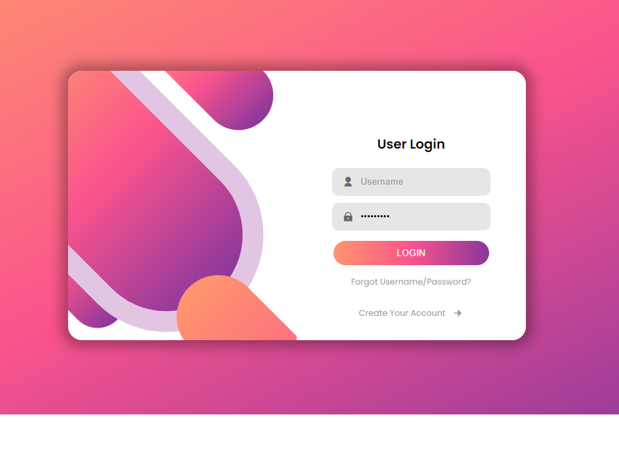

# **Tela de Login**

## ``Descrição``
Este projeto fornece uma página de login moderna e visualmente atraente criada em HTML e CSS. O design inclui fundos gradientes, iconografia e formas geométricas criativas para uma interface de usuário exclusiva.

## ``Ìndice``

* [Pré-requisitos](#pré-requisitos)
* [Customização](#customização)

## ``Pré-requisitos``

Um navegador da web para visualizar e interagir com a página de login.

## ``Customização``

Fonte: O projeto usa a fonte “Poppins” do Google Fonts. Você pode substituí-la por outra fonte de sua escolha modificando a instrução @import no arquivo CSS.

Cores: personalize o esquema de cores ajustando os valores de gradiente no arquivo CSS. Os valores do gradiente linear nos estilos de corpo e botão determinam o esquema de cores.

Logotipo/Ícone: Substitua ou adicione seu logotipo/ícone modificando os elementos <i> no arquivo HTML com a classe e conteúdo apropriados.

## ``Créditos``

* Autor: Luamy Alves Gama

* Fontes utilizadas: [codethi](https://github.com/codethi/signin-signup-jsvanilla)